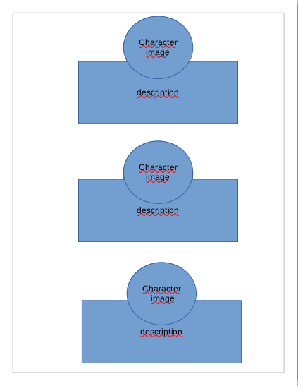
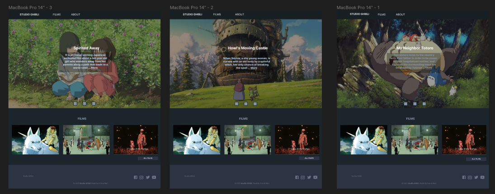
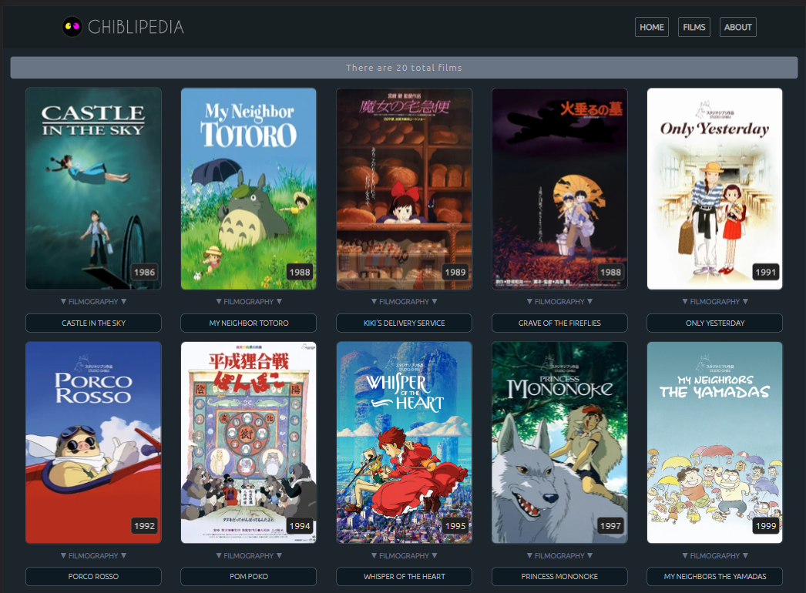
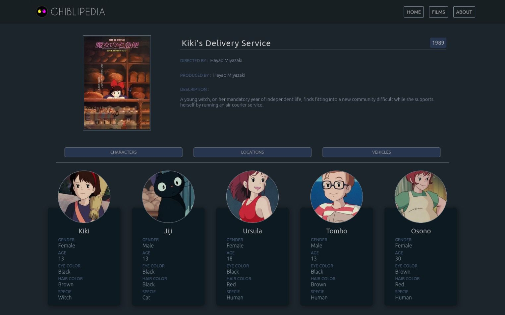
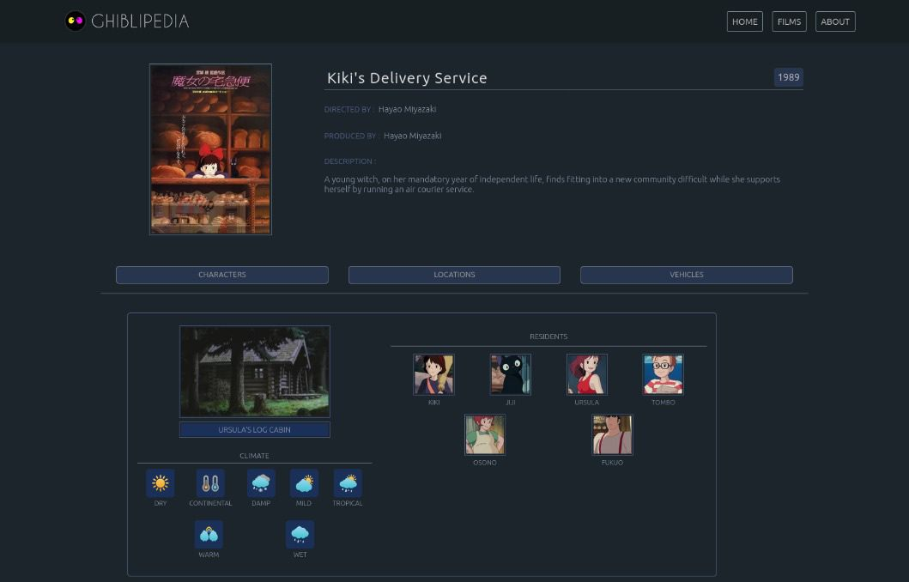

# GhibliPedia

## Índice

- [1. Introducción](#1-introducción)
- [2. Prototipos de baja fidelidad](#2-prototipos-de-baja-fidelidad)
- [3. Prototipos de alta fidelidad](#3-prototipos-de-alta-fidelidad)
- [4. Historia de usuario 1](#4-historias-de-usuario-1)
- [5. Historia de usuario 2](#5-historias-de-usuario-2)
- [6. Historia de usuario 3](#6-historias-de-usuario-3)
- [7. Historia de usuario 4](#7-historia-de-usuario-4)
- [8. Historia de usuario 5](#8-historia-de-usuario-5)

---

## 1. Introducción

GhibliPedia es un sitio web de animaciones de Studio Ghibli, el cual es un estudio de animación japonés, conocido por sus largometrajes
animados como **Mi vecino Totoro**, **El viaje de Chihiro** o
**El castillo ambulante**, entre otros grandes éxitos.
Las animaciones tienen gran acogida a nivel mundial y algunas han recibido varias nominaciones y premios. De todo este fandom nos dimos cuenta que hay un grupo que desea poder interactuar y ver la información de las animaciones y sus personajes. A raíz de ello se crea este sitio web para poder filtrar información y ver la filmografia de cada animación.

Entre la información más relevante están los directores y productores, año de estreno, rating, personajes, locaciones, vehiculos y algunos datos curiosos.

## 2. Prototipos de baja fidelidad

  
  
  
  

## 3. Prototipos de alta fidelidad

## 4. Historias de usuario 1

Yo como no-consumidor de anime:

QUIERO que la página me muestre las películas animadas más destacadas.

PARA que pueda darme una noción de la película animada que veré.

### Criterios de aceptación

- [x] El usuario puede acceder a los links de los films destacados.
- [x] El usuario puede acceder a un botón que le muestre todos los films.
- [x] El usuario puede ver de manera interactiva ver pasar los films destacados sin necesidad de apretar algo.
- [x] El usuario puede acceder al botón de about.

### Definición de terminado (DoD)

- [x] El código está en el repositorio.
- [x] El código cumple con el prototipo acordado.
- [x] El código ha sido hecho en pair-programming.
- [x] La historia implementada ha sido testeada por 3 usuarios y se han incorporado las mejoras que se identificaron en el testeo de usabilidad.
- [x] El código cumple con redirigir a los films destacados.
- [x] El código fue implementado con animaciones.
- [x] El código tiene una barra de navegación desplegable.

### Cuestionario de usuarios

| Pregunta                                                                                                                            | %    |
| ----------------------------------------------------------------------------------------------------------------------------------- | ---- |
| Creo que me gustaria usar este sistema con frecuencia                                                                               | 100% |
| Encontramos la página innecesariamente compleja                                                                                     | 0%   |
| Encontré el sistema muy engorroso de usar                                                                                           | 0%   |
| Me sentí a gusto y confiado usando el sistema                                                                                       | 90%  |
| Creo que necesitaria el apoyo de un tecnico para poder utilizar este sistema                                                        | %0   |
| Descubri que las diversas funciones de este sistema estaban bien integradas                                                         | %80  |
| Creo que dentro de los elementos que muestra esta pantalla, hay algo fuera de lugar, porque no pertenece al sitio web Studio Ghibli | 0%   |
| Creo que el logotipo del sitio web estásuficientemente destacado dentro de la(s) página(s)?                                         | 50%  |
| Se ofrece información de contacto y no me costó encontrarla en la página web                                                        | 100% |
| Me parecio adecuada la selección de contenidos presentes en el menú principal                                                       | 80%  |
| Eché en falta otras áreas de información                                                                                            | 40%  |

### Resultados de testing

Escenario 1:

Nunca has visto una pelicula de anime y te recomendaron entrar al Studio ghibli para comenzar a adentrarte en ese mundo.

Tarea 1:

Barra de navegacion

Entiende y despliega adecuadamente la barra de navegación. 100%

Tarea 2:

Carrusel de imágenes

No encuentra un botón para regresar a las animaciones anteriores.

Solución : se proporcionó 3 botones para cada imágen dentro del carrusel deteniendo la animación.

tarea 3:

Films destacados

No encuentra los títulos de los films que aparecen.

Solución : se añadió el titulo al pie de la imagen del film.

Tarea 4:

Footer

Encuentra facilmente la información de contacto. 100%

## 5. Historias de usuario 2

Yo como fanatico de Studio Ghibli.

QUIERO un botón donde estén todas las animaciones y unos botones para filtrarlas.

PARA una vista panorámica de todas las animaciones y poder buscarlas según mis necesidades y ver que filmography visito.

### Criterios de aceptación

- [x] El usuario puede ver todas las animaciones solo clickeando un botón.
- [x] El usuario puede acceder a unos botones para filtrar los films.
- [x] El usuario puede ver el poster y el año de estreno de los films en la tarjeta.
- [x] El usuario puede ver la descripción de los films al voltear la tarjeta.
- [x] El usuario puede voltear la tarjeta en el estado responsivo cuantas veces quiera.

### Definición de terminado (DoD)

- [x] El código está en el repositorio.
- [x] El código cumple con el prototipo acordado.
- [x] El código ha sido hecho al 60% en pair-programming.
      La historia implementada ha sido testeada por 3 usuarios y se han incorporado las mejoras que se identificaron en el testeo de usabilidad.
- [x] El código cumple con mostrar los films de la data.
- [x] El código filtra data y muestra los films según orden alfabetico.
- [x] El código filtra data y muestra los films según su decada de estreno.
- [x] El código filtra data y muestra los films según su rating.
- [x] El código filtra data y muestra los films según su director.
- [x] El código filtra data y muestra los films según el texto del input.
- [x] El código fue implementado con animaciones.
- [x] El codigo tiene una barra de navegación desplegable para los browser.
- [x] El código tiene pruebas unitarias.

### Cuestionario de Usuarios

| Pregunta                                                                                                                            | %    |
| ----------------------------------------------------------------------------------------------------------------------------------- | ---- |
| Creo que me gustaria usar este sistema con frecuencia                                                                               | 100% |
| Encontramos la página innecesariamente compleja                                                                                     | 0%   |
| Encontré el sistema muy engorroso de usar                                                                                           | 0%   |
| Me sentí a gusto y confiado usando el sistema                                                                                       | 100% |
| Creo que necesitaria el apoyo de un tecnico para poder utilizar este sistema                                                        | 0%   |
| Descubri que las diversas funciones de este sistema estaban bien integradas                                                         | 70%  |
| Creo que dentro de los elementos que muestra esta pantalla, hay algo fuera de lugar, porque no pertenece al sitio web Studio Ghibli | 0%   |
| Creo que el logotipo del sitio web estásuficientemente destacado dentro de la(s) página(s)                                          | 50%  |
| Se ofrece información de contacto y no me costó encontrarla en la página web                                                        | 100% |
| Me pareció adecuada la selección de contenidos presentes en el menú principal                                                       | 100% |
| Eché en falta otras áreas de información                                                                                            | 80%  |
| Me pareció accesible y fácil de buscar las filtraciones                                                                             | 90%  |
| Me pareció fácil de usar la barra de navegación                                                                                     | 70%  |
| Las animaciones responden correctamente                                                                                             | 60%  |

### Resultados de testing

Escenario 1
Quieres escoger un film pero piensas que pueden ser muchos y necesitas filtrarlos para entresacar los que más te interesan.

Tarea 1:

Barra de navegación

No puede colapsar barra de navegación sin apretar la X. 70%

Solución : se agregó código javascript para que al apretar cualquier parte del documento exterior se colapse la barra de navegación.

Tarea 2:

Footer

Encuentra fácilmente la información de contacto. 100%

Tarea 3:

Mostrar tarjetas de films

Encuentra los films que quiere por filtrado. 100%

Tarea 4:

Animaciones de tarjetas films

No voltea en celular la tarjeta de vuelta cuando está en la parte trasera. 60%

Solución : se agregó código javascript para que al clickear en la tarjeta voltee a la cara posterior.

Tarea 5:

Lista desplegable del browser

Encuentra muy caotico los botones de busqueda. 80%

Solución : Ultilizar flexbox para alinear los botones.

Tarea 6:

Filtación de films

Filtra correctamente todas las opciones. 100%

## 6. Historias de usuario 3

Yo como fanatico de Studio Ghibli:

QUIERO a que al entrar en una animacion muestre una descripcion, director y año.

PARA ver si me animo a verla y saber quien la dirigió y poder decidir si veo una pelicula antigua o nueva.

### Criterios de aceptacion

- [x] El usuario puede ver la filmografía en detalle despues de hacer click en el film escogido.
- [x] El usuario puede ver el titulo del film.
- [x] El usuario puede ver el director y productor del film.
- [x] El usuario puede ver el poster y el año de estreno del film.
- [x] El usuario puede ver la descripción del film.

### Definición de terminado (DoD)

- [x] El código está en el repositorio.
- [x] El código cumple con el prototipo acordado.
- [x] El código ha sido hecho al 90% en pair-programming.
- [x] La historia implementada ha sido testeada por 3 usuarios y se han incorporado las mejoras que se identificaron en el testeo de usabilidad.
- [x] El código cumple con mostrar el titulo del film.
- [x] El código cumple con mostrar el director y productor.
- [x] El código cumple con mostrar el poster y año de estreno.
- [x] El código fue implementado con animaciones.
- [x] El código tiene pruebas unitarias.

### Cuestionario de usuarios

| Pregunta                                                                                                                            | %    |
| ----------------------------------------------------------------------------------------------------------------------------------- | ---- |
| Creo que me gustaría usar este sistema con frecuencia                                                                               | 100% |
| Encontramos la página innecesariamente compleja                                                                                     | 0%   |
| Encontré el sistema muy engorroso de usar                                                                                           | 0%   |
| Me sentí a gusto y confiado usando el sistema                                                                                       | 100% |
| Creo que necesitaría el apoyo de un técnico para poder utilizar este sistema                                                        | 0%   |
| Descubrí que las diversas funciones de este sistema estaban bien integradas                                                         | 80%  |
| Creo que dentro de los elementos que muestra esta pantalla, hay algo fuera de lugar, porque no pertenece al sitio web Studio Ghibli | 0%   |
| Creo que el logotipo del sitio web estásuficientemente destacado dentro de la(s) página(s)?                                         | 60%  |
| Se ofrece información de contacto y no me costó encontrarla en la página web                                                        | 100% |
| Me pareció adecuada la selección de contenidos presentes en el menú principal                                                       | 100% |
| Eché en falta otras áreas de información                                                                                            | 50%  |
| Las animaciones responden correctamente                                                                                             | 80%  |
| Me parece lo suficientemente descriptivo para entender de que trata el film                                                         | 90%  |

### Resultado de testing

Escenario 1

Quieres ver la información total de un film que hayas escogido.

Tarea 1

Redirección al film escogido

Encuentra fácilmente el botón al hacer click para redireccionar al film escogido 90%

Tarea 2

Visualización de la información total del film
Encuentra satisfactoriamente completa la información detallada 100%

tarea 3

footer

encuentra facilmente la información de contacto 100%

## 7. Historia de usuario 4

Yo como fanatico de Studio Ghibli:

QUIERO una sección donde estén todos los personajes y sus características.

PARA recordar como eran los personajes y curiosidad.

### Criterios de aceptación

- [x] El usuario puede ver los personajes en detalle después de hacer click en el botón characters.
- [x] El usuario puede ver la imagen de cada personaje.
- [x] El usuario puede ver sus caracteristicas.

### Definición de terminado (DoD)

- [x] El código está en el repositorio.
- [x] El código cumple con el prototipo acordado.
- [x] El código ha sido hecho al 95% en pair-programming.
- [x] La historia implementada ha sido testeada por 3 usuarios y se han incorporado las mejoras que se identificaron en el testeo de usabilidad.
- [x] El código cumple con mostrar la foto de cada personaje.
- [x] El código cumple con mostrar el nombre de cada personaje.
- [x] El código cumple con mostrar las caracteristicas de cada personaje.
- [x] El código tiene pruebas unitarias.

### Cuestionario de de usuarios

| Pregunta                                                                                                                            | %    |
| ----------------------------------------------------------------------------------------------------------------------------------- | ---- |
| Creo que me gustaría usar este sistema con frecuencia                                                                               | 100% |
| Encontramos la página innecesariamente compleja                                                                                     | 0%   |
| Encontré el sistema muy engorroso de usar                                                                                           | 0%   |
| Me sentí a gusto y confiado usando el sistema                                                                                       | 100% |
| Creo que necesitaría el apoyo de un técnico para poder utilizar este sistema                                                        | 0%   |
| Descubrí que las diversas funciones de este sistema estaban bien integradas                                                         | 90%  |
| Creo que dentro de los elementos que muestra esta pantalla, hay algo fuera de lugar, porque no pertenece al sitio web Studio Ghibli | 0%   |
| Creo que el logotipo del sitio web estásuficientemente destacado dentro de la(s) página(s)?                                         | 60%  |
| Se ofrece información de contacto y no me costó encontrarla en la página web                                                        | 100% |
| Me pareció adecuada la selección de contenidos presentes en el menú principal                                                       | 100% |
| Eché en falta otras áreas de información                                                                                            | 70%  |
| Las animaciones responden correctamente                                                                                             | 90%  |
| Me pareció completa la información de los personajes                                                                                | 90%  |

### Resultados de testing

Escenario 1

Quieres ver la información detallada de cada personaje del film escogido.

Tarea 1

Botón characters

Encuentra fácilmente el botón para mostrar personajes 100%

Tarea 2

Visualización de la tarjeta del personaje

Encuentra ordenada y satisfactoriamente completa las caracteristicas del personaje 90%

Tarea 3

Footer

## 8. Historia de usuario 5

Yo como fanático de Studio Ghibli:

QUIERO poder ver las locaciones y vehiculos de las peliculas.

PARA poder internarme en ese mundo y saber detalles curiosos de los vehiculos que me gustaron.

### Criterios de aceptación

- [x] El usuario puede ver las locaciones y vehiculos en detalle después de hacer click en el botón locations y en el botón vehicles.
- [x] El usuario puede ver la imagen de cada locación y vehiculo.

### Definición de terminado (DoD)

- [x] El código está en el repositorio.
- [x] El código cumple con el prototipo acordado.
- [x] El código ha sido hecho al 97% en pair-programming.
- [x] La historia implementada ha sido testeada por 3 usuarios y se han incorporado las mejoras que se identificaron en el testeo de usabilidad.
- [x] El código cumple con mostrar la foto de cada locación y vehículo.
- [x] El código cumple con mostrar la descripción de vehiculo.
- [x] El código tiene pruebas unitarias.
- [x] Encuentra facilmente la información de contacto.

### Cuestionario de usuarios

| Pregunta                                                                                                                            | %    |
| ----------------------------------------------------------------------------------------------------------------------------------- | ---- |
| Creo que me gustaría usar este sistema con frecuencia                                                                               | 100% |
| Encontramos la página innecesariamente compleja                                                                                     | 0%   |
| Encontré el sistema muy engorroso de usar                                                                                           | 0%   |
| Me sentí a gusto y confiado usando el sistema                                                                                       | 100% |
| Creo que necesitaría el apoyo de un técnico para poder utilizar este sistema                                                        | 0%   |
| Descubrí que las diversas funciones de este sistema estaban bien integradas                                                         | 80%  |
| Creo que dentro de los elementos que muestra esta pantalla, hay algo fuera de lugar, porque no pertenece al sitio web Studio Ghibli | 0%   |
| Creo que el logotipo del sitio web estásuficientemente destacado dentro de la(s) página(s)?                                         | 60%  |
| Se ofrece información de contacto y no me costó encontrarla en la página web                                                        | 100% |
| Me pareció adecuada la selección de contenidos presentes en el menú principal                                                       | 100% |
| Eché en falta otras áreas de información                                                                                            | 80%  |
| Me pareció completa la información de las locaciones                                                                                | 60%  |
| Me pareció completa la información de los vehículos                                                                                 | 50%  |

### Resultados de Testing

Escenario 1

Quieres ver la información detallada de locación y vehículo del film escogido

Tarea 1

Botón locations

Encuentra fácilmente el botón para mostrar locaciones 100%

Tarea 2

Botón vehicles

Encuentra fácilmente el botón para mostrar vehículos 100%

Tarea 3

Visualización de la tarjeta de locaciones

Encuentra ordenada y satisfactoriamente completa las caracteristicas de la locación 70%

Tarea 4

Visualización de la tarjeta de vehiculos

Encuentra ordenada y satisfactoriamente completa las caracteristicas de los vehiculos 70%

Tarea 3

Footer

Encuentra facilmente la información de contacto 100%
